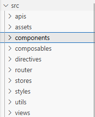

# 项目笔记

## 1 创建项目和git仓库

### 1.1创建vue3项目

### 1.2src下创建项目结构



1.3初始化git并推送github仓库

1.4别名路径配置

输入@联想路径地址

比如

```
import HelloWorld from '@/components/HelloWorld.vue'
```

在src根目录下创建jsconfig.json

```
{
  "compilerOptions" : {
    "baseUrl" : "./",
    "paths" : {
      "@/*":["src/*"]
    }
  }
}
```

但是这个配置只做联想提示

真正起作用的是

vite.config.js

```
 resolve: {
    //实际路劲转换 @ -》src
    alias: {
      '@': fileURLToPath(new URL('./src', import.meta.url))
    },
  },
```


## 2 添加饿了么组件

安装

```
npm install element-plus --save
```

导入

```
npm install -D unplugin-vue-components unplugin-auto-import
```

更新vite.config.ts配置文件

```
//element plus 按需导入
import AutoImport from 'unplugin-auto-import/vite'
import Components from 'unplugin-vue-components/vite'
import { ElementPlusResolver } from 'unplugin-vue-components/resolvers'


export default defineConfig({
  plugins: [
    vue(),
    vueDevTools(),

    AutoImport({
      resolvers: [ElementPlusResolver()],
    }),
    Components({
      resolvers: [ElementPlusResolver()],
    }),
    
```

测试

在App.vue

```
<script setup>
  
</script>

<template>
  <el-button type="primary">Primary</el-button>
  
</template>

<style scoped></style>

```

