# 项目笔记

## 1 创建项目和git仓库

创建vue3项目

src下创建项目结构


初始化git并推送github仓库

别名路径配置

​	输入@联想路径地址

​	比如

```
import HelloWorld from '@/components/HelloWorld.vue'
```

在src根目录下创建jsconfig.json

```
{
  "compilerOptions" : {
    "baseUrl" : "./",
    "paths" : {
      "@/*":["src/*"]
    }
  }
}
```

​	但是这个配置只做联想提示

​	真正起作用的是

vite.config.js

```
 resolve: {
    //实际路劲转换 @ -》src
    alias: {
      '@': fileURLToPath(new URL('./src', import.meta.url))
    },
  },
```


## 2 添加饿了么组件

安装

```
npm install element-plus --save
```

导入

```
npm install -D unplugin-vue-components unplugin-auto-import
```

更新vite.config.ts配置文件

```
//element plus 按需导入
import AutoImport from 'unplugin-auto-import/vite'
import Components from 'unplugin-vue-components/vite'
import { ElementPlusResolver } from 'unplugin-vue-components/resolvers'


export default defineConfig({
  plugins: [
    vue(),
    vueDevTools(),

    AutoImport({
      resolvers: [ElementPlusResolver()],
    }),
    Components({
      resolvers: [ElementPlusResolver()],
    }),
    
```

测试

在App.vue

```
<script setup>
  
</script>

<template>
  <el-button type="primary">Primary</el-button>
  
</template>

<style scoped></style>

```

### 2.2定制主题色

安装sass

```
npm i sass -D
```

添加目录

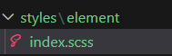

放入配置

```
@forward 'element-plus/theme-chalk/src/common/var.scss' with (
  $colors: (
    'primary': (
      // 主色
      'base': #27ba9b,
    ),
    'success': (
      // 成功色
      'base': #1dc779,
    ),
    'warning': (
      // 警告色
      'base': #ffb302,
    ),
    'danger': (
      // 危险色
      'base': #e26237,
    ),
    'error': (
      // 错误色
      'base': #cf4444,
    ),
  )
)
```

更新vite.config.ts文件

```
import { fileURLToPath, URL } from 'node:url'

import { defineConfig } from 'vite'
import vue from '@vitejs/plugin-vue'
import vueDevTools from 'vite-plugin-vue-devtools'

//element plus 按需导入
import AutoImport from 'unplugin-auto-import/vite'
import Components from 'unplugin-vue-components/vite'
import { ElementPlusResolver } from 'unplugin-vue-components/resolvers'

// https://vite.dev/config/
export default defineConfig({
  plugins: [
    vue(),
    vueDevTools(),

    AutoImport({
      resolvers: [ElementPlusResolver()],
    }),
    Components({
      resolvers: [
        //1.
        ElementPlusResolver({ importStyle:'sass'}),
      ],
    }),

  ],
  resolve: {
    //实际路劲转换 @ -》src
    alias: {
      '@': fileURLToPath(new URL('./src', import.meta.url))
    },
  },
  css: {
    preprocessorOptions: {
      scss: {
        // 自动导入定制化样式文件进行样式覆盖
        additionalData: `
          @use "@/styles/element/index.scss" as *;
        `,
      }
    }
  }
})

```

## 3 基础实例配置

axios基础配置

安装

```
npm i axios
```

​	在utils目录下创建http.js

```
//axios基础封装

import axios from "axios";

const httpInstance = axios.create({
    baseURL: 'https://pcapi-xiaotuxian-front-devtest.itheima.net',
    timeout: 5000
})

//拦截器
// axios请求拦截器
httpInstance.interceptors.request.use(config => {
  return config
}, e => Promise.reject(e))

// axios响应式拦截器
httpInstance.interceptors.response.use(res => res.data, e => {
  return Promise.reject(e)
})


export default httpInstance
```

这东西是给API服务的

创建testAPI.js

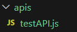

配置

```
import httpInstance from "@/utils/http";

export function getCategory () {
  return httpInstance({
    url: 'home/category/head'
  })
}
```

测试

在main.js里添加测试接口

```
//测试接口函数
import { getCategory } from '@/apis/testAPI'
getCategory().then(res =>{
    console.log(res)
})
```

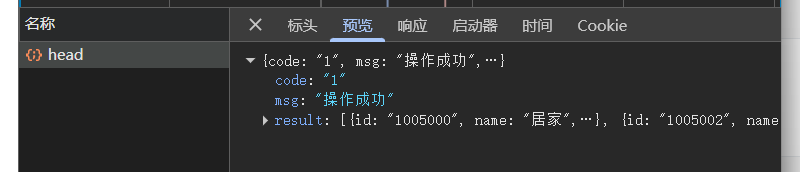

成功


## 4 路由设置

一级路由（页面整体切换）

1.创建页面

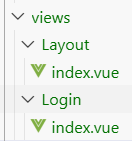

2.在router里的index.js配置路由表

```
 routes: [
    {
      path:'/',
      component:Layout
    },
    {
      path:'/login',
      component:Login
    }
  ],
```

3.App.js配置路由出口

```
<template>
  <!--一级路由出口组件-->
  <router-view/>
</template>
```


二级路由（在一级路由页内部切换）

1.创建页面

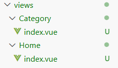

2.在router里的index.js配置路由表

```
{
      path:'/',
      component:Layout,
      children:[
        {
          path:'',   //默认二级路由，置空
          component:Home
        },
        {
          path:'category',
          component:Category
        }
      ]
    },
```

3.Layout.js配置路由出口

```
<template>
    <div>我是首页
    <!--二级路由出口-->
    <RouterView/>
    </div>
</template>
```


## 5 静态资源引入
###  静态资源引入

1. 图片资源 - 把 images 文件夹放到 assets 目录下
2. 样式资源 - 把 common.scss 文件放到 styles 目录下

### scss变量自动导入

```css
$xtxColor: #27ba9b;
$helpColor: #e26237;
$sucColor: #1dc779;
$warnColor: #ffb302;
$priceColor: #cf4444;
```
```json
css: {
    preprocessorOptions: {
      scss: {
        // 自动导入scss文件
        additionalData: `
          @use "@/styles/element/index.scss" as *;
          @use "@/styles/var.scss" as *;
        `,
      }
    }
}
```

## 6 Layout页面搭建

创建页面结构如下 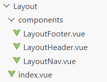

配置路由   （Layout/index.vue）

```
<script setup>
import LayoutNav from './components/LayoutNav.vue'
import LayoutHeader from './components/LayoutHeader.vue'
import LayoutFooter from './components/LayoutFooter.vue'
</script>

<template>
  <div>
  <LayoutNav />
  <LayoutHeader />
  <RouterView />
  <LayoutFooter />
  </div>
</template>
```

效果：

### 6.1引入阿里图标库

网址：https://www.iconfont.cn/help/detail?spm=a313x.help_index.i3.48.21523a81nYt6cR&helptype=code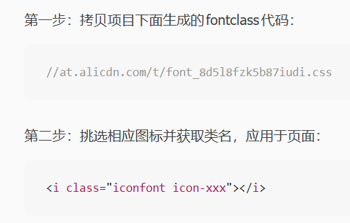

> 字体图标采用的是阿里的字体图标库，样式文件已经准备好，在 `index.html`文件中引入即可

```html
  <link rel="stylesheet" href="//at.alicdn.com/t/font_2143783_iq6z4ey5vu.css">
```

### 6.2 一级导航渲染

封装请求函数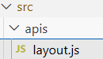

```
import httpInstance from "@/utils/http";

export function getCategoryAPI(){
    return httpInstance({
        url:'/home/category/head'
    })
}

```

LayoutHeader.vue 更新接口请求代码

```
<script setup>
import {getCategoryAPI} from '@/apis/layout'
import { ref,onMounted } from 'vue'

const categoryList =ref([])
const getCategory = async() =>{
  const res = await getCategoryAPI()
  console.log(res)
  categoryList.value = res.result
}

onMounted(() =>{
  getCategory()
})
</script>

<template>
  <header class='app-header'>
    <div class="container">
      <h1 class="logo">
        <RouterLink to="/">小兔鲜</RouterLink>
      </h1>
      <ul class="app-header-nav">
        <li class="home" v-for="item in categoryList" :key="item.id">
          <RouterLink to="/">{{item.name}}</RouterLink>
        </li>
        
      </ul>
      <div class="search">
        <i class="iconfont icon-search"></i>
        <input type="text" placeholder="搜一搜">
      </div>
      <!-- 头部购物车 -->
      
    </div>
  </header>
</template>
```

### 6.3吸顶导航

逻辑：准备吸顶导航组件 -》 获取滚动距离 -》以滚动距离做判断条件控制组件盒子是否展示

#### 1.准备吸顶导航组件

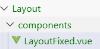

```
<script setup>

</script>

<template>
  <div class="app-header-sticky">
    <div class="container">
      <RouterLink class="logo" to="/" />
      <!-- 导航区域 -->
      <ul class="app-header-nav ">
        <li class="home">
          <RouterLink to="/">首页</RouterLink>
        </li>
        <li>
          <RouterLink to="/">居家</RouterLink>
        </li>
        <li>
          <RouterLink to="/">美食</RouterLink>
        </li>
        <li>
          <RouterLink to="/">服饰</RouterLink>
        </li>
        <li>
          <RouterLink to="/">母婴</RouterLink>
        </li>
        <li>
          <RouterLink to="/">个护</RouterLink>
        </li>
        <li>
          <RouterLink to="/">严选</RouterLink>
        </li>
        <li>
          <RouterLink to="/">数码</RouterLink>
        </li>
        <li>
          <RouterLink to="/">运动</RouterLink>
        </li>
        <li>
          <RouterLink to="/">杂项</RouterLink>
        </li>
      </ul>

      <div class="right">
        <RouterLink to="/">品牌</RouterLink>
        <RouterLink to="/">专题</RouterLink>
      </div>
    </div>
  </div>
</template>


<style scoped lang='scss'>
.app-header-sticky {
  width: 100%;
  height: 80px;
  position: fixed;
  left: 0;
  top: 0;
  z-index: 999;
  background-color: #fff;
  border-bottom: 1px solid #e4e4e4;
  // 此处为关键样式!!!
  // 状态一：往上平移自身高度 + 完全透明
  transform: translateY(-100%);
  opacity: 0;

  // 状态二：移除平移 + 完全不透明
  &.show {
    transition: all 0.3s linear;
    transform: none;
    opacity: 1;
  }

  .container {
    display: flex;
    align-items: center;
  }

  .logo {
    width: 200px;
    height: 80px;
    background: url("@/assets/images/logo.png") no-repeat right 2px;
    background-size: 160px auto;
  }

  .right {
    width: 220px;
    display: flex;
    text-align: center;
    padding-left: 40px;
    border-left: 2px solid $xtxColor;

    a {
      width: 38px;
      margin-right: 40px;
      font-size: 16px;
      line-height: 1;

      &:hover {
        color: $xtxColor;
      }
    }
  }
}

.app-header-nav {
  width: 820px;
  display: flex;
  padding-left: 40px;
  position: relative;
  z-index: 998;

  li {
    margin-right: 40px;
    width: 38px;
    text-align: center;

    a {
      font-size: 16px;
      line-height: 32px;
      height: 32px;
      display: inline-block;

      &:hover {
        color: $xtxColor;
        border-bottom: 1px solid $xtxColor;
      }
    }

    .active {
      color: $xtxColor;
      border-bottom: 1px solid $xtxColor;
    }
  }
}
</style>
```

吸顶组件有个样式代码

```
 &.show {
    transition: all 0.3s linear;
    transform: none;
    opacity: 1;
  }
```

如果

```
<div class="app-header-sticky">
```

变成

```
<div class="app-header-sticky" show>
```

那么组件就显示，那么show的开启与否就是开启的条件

#### 2.获取滚动距离

需要用到一个工具

**VueUse** 是一个巨大的 **Vue 组合式 API (Composition API)** 工具集

https://vueuse.org/

安装它 

```
npm i @vueuse/core
```

搜索useScroll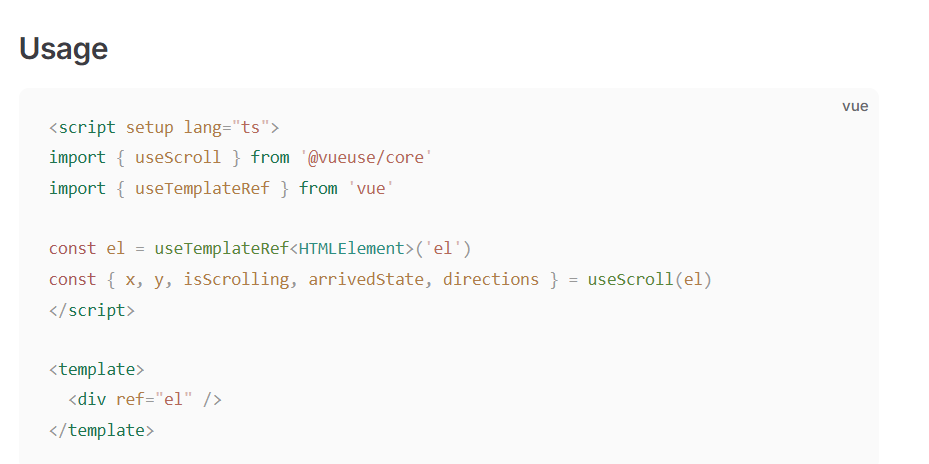

测试

```
<script setup>
//vue Use
import { useScroll } from '@vueuse/core'
const {y} = useScroll(window)
</script>

<template>
  <div class="app-header-sticky">
    {{ y }}
```

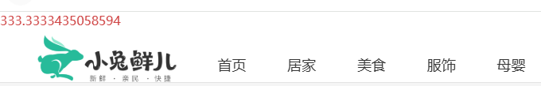

#### 3.show条件开启

```
<template>
  <div class="app-header-sticky" :class="{ show:y > 78 }">
    <div class="container">
```

### 6.4重复请求优化

为啥

LayoutFixed.vue和LayoutHeader.vue 发送了两次相同网络请求，资源浪费

逻辑图

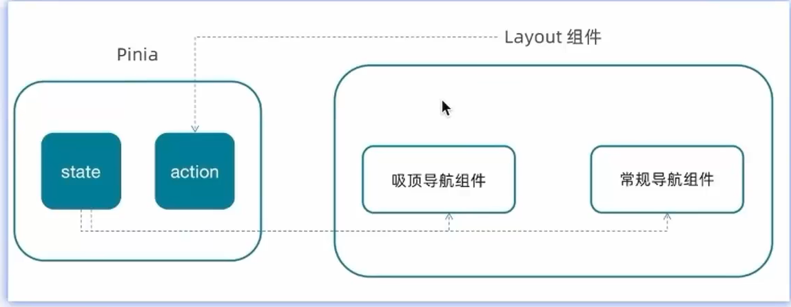

创建文件

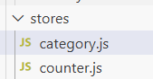

```
import { ref } from 'vue'
import { defineStore } from 'pinia'
import {getCategoryAPI} from '@/apis/layout'


export const useCategoryStore = defineStore('category', () => {
    //导航列表的数据管理
    //state 导航列表数据
    const categoryList =ref([])

    //action 获取导航数据的方法
    const getCategory = async() =>{
    const res = await getCategoryAPI()
    categoryList.value = res.result
    }

    return{
        categoryList,
        getCategory
    }
})

```

组件页使用pinia中的数据

```
import { useCategoryStore } from '@/stores/category';
const categoryStore = useCategoryStore()

......
<li class="home" v-for="item in categoryStore.categoryList" :key="item.id">
          <RouterLink to="/">{{item.name}}</RouterLink>
        </li>
```


## 7 Home 页面搭建

页面结构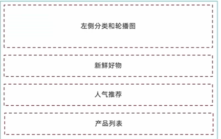

组件页创建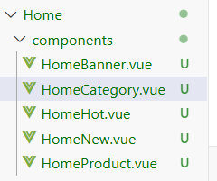

### 7.1 分类实现  （准备模板 -》使用Pinia中的数据渲染）

```
<script setup>
import {useCategoryStore} from '@/stores/category'

const categoryStore = useCategoryStore()
</script>

<template>
  <div class="home-category">
    <ul class="menu">
      <li v-for="item in categoryStore.categoryList" :key="item.id">
        <RouterLink to="/">{{item.name}}</RouterLink>
        <RouterLink v-for="i in item.children.slice(0,2)" :key="i" to="/">{{i.name}}</RouterLink>
        <!-- 弹层layer位置 -->
        <div class="layer">
          <h4>分类推荐 <small>根据您的购买或浏览记录推荐</small></h4>
          <ul>
            <li v-for="i in item.goods" :key="i.id">
              <RouterLink to="/">
                
                <div class="info">
                  <p class="name ellipsis-2">
                    {{i.name}}
                  </p>
                  <p class="desc ellipsis">{{i.desc}}</p>
                  <p class="price"><i>¥</i>{{i.price}}</p>
                </div>
              </RouterLink>
            </li>
          </ul>
        </div>
      </li>
    </ul>
  </div>
</template>


<style scoped lang='scss'>
.home-category {
  width: 250px;
  height: 500px;
  background: rgba(0, 0, 0, 0.8);
  position: relative;
  z-index: 99;

  .menu {
    li {
      padding-left: 40px;
      height: 55px;
      line-height: 55px;

      &:hover {
        background: $xtxColor;
      }

      a {
        margin-right: 4px;
        color: #fff;

        &:first-child {
          font-size: 16px;
        }
      }

      .layer {
        width: 990px;
        height: 500px;
        background: rgba(255, 255, 255, 0.8);
        position: absolute;
        left: 250px;
        top: 0;
        display: none;
        padding: 0 15px;

        h4 {
          font-size: 20px;
          font-weight: normal;
          line-height: 80px;

          small {
            font-size: 16px;
            color: #666;
          }
        }

        ul {
          display: flex;
          flex-wrap: wrap;

          li {
            width: 310px;
            height: 120px;
            margin-right: 15px;
            margin-bottom: 15px;
            border: 1px solid #eee;
            border-radius: 4px;
            background: #fff;

            &:nth-child(3n) {
              margin-right: 0;
            }

            a {
              display: flex;
              width: 100%;
              height: 100%;
              align-items: center;
              padding: 10px;

              &:hover {
                background: #e3f9f4;
              }

              img {
                width: 95px;
                height: 95px;
              }

              .info {
                padding-left: 10px;
                line-height: 24px;
                overflow: hidden;

                .name {
                  font-size: 16px;
                  color: #666;
                }

                .desc {
                  color: #999;
                }

                .price {
                  font-size: 22px;
                  color: $priceColor;

                  i {
                    font-size: 16px;
                  }
                }
              }
            }
          }
        }
      }

      // 关键样式  hover状态下的layer盒子变成block
      &:hover {
        .layer {
          display: block;
        }
      }
    }
  }
}
</style>
```

### 7.2 轮播图实现

1.使用element plus组件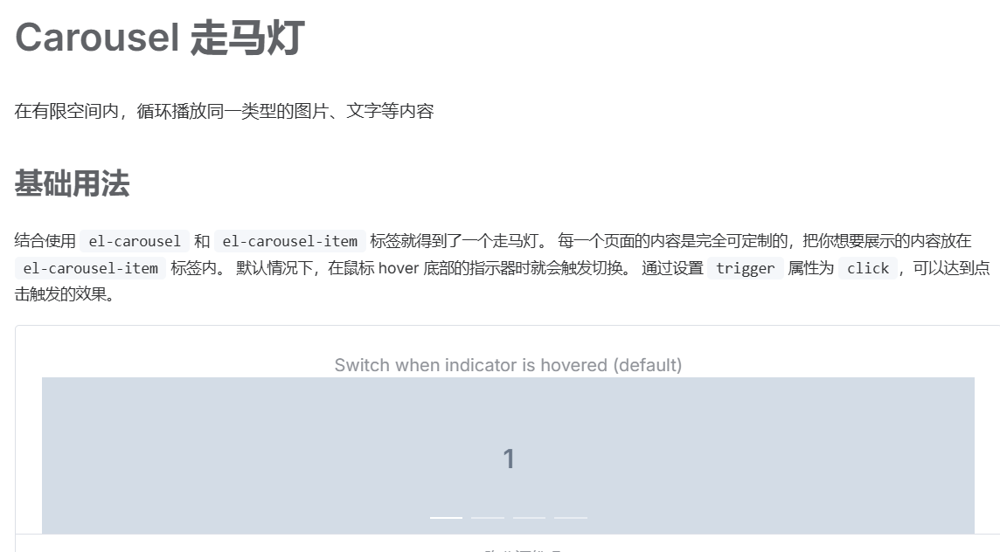


2.获取接口数据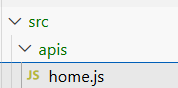

```
import httpInstance from "@/utils/http";

//封装banner

export function getBannerAPI(){
    return httpInstance({
        url:'/home/banner'
    })
}
```

3.展示数据

```
<script setup>
import {getBannerAPI} from '@/apis/home'
import { onMounted,ref } from 'vue'

const bannerList = ref([])
const getBanner = async() =>{
    const res = await getBannerAPI()
    console.log(res)
    bannerList.value = res.result
}

onMounted(() => getBanner())
</script>

<template>
  <div class="home-banner">
    <el-carousel height="500px">
      <el-carousel-item v-for="item in bannerList" :key="item.id">
        
      </el-carousel-item>
    </el-carousel>
  </div>
</template>
```

### 7.3 组件封装

步骤：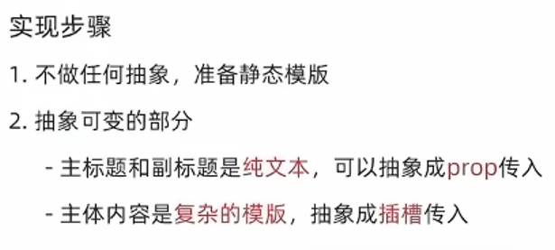

1.模板

```
<script setup>

</script>


<template>
  <div class="home-panel">
    <div class="container">
      <div class="head">
         <!-- 主标题和副标题 -->
        <h3>
          新鲜好物<small>新鲜出炉 品质靠谱</small>
        </h3>
      </div>
      <!-- 主体内容区域 -->
      <div> 主体内容 </div>
    </div>
  </div>
</template>

<style scoped lang='scss'>
.home-panel {
  background-color: #fff;

  .head {
    padding: 40px 0;
    display: flex;
    align-items: flex-end;

    h3 {
      flex: 1;
      font-size: 32px;
      font-weight: normal;
      margin-left: 6px;
      height: 35px;
      line-height: 35px;

      small {
        font-size: 16px;
        color: #999;
        margin-left: 20px;
      }
    }
  }
}
</style>
```

2.组件参数

```
<script setup>
//定义props
defineProps({
  title:{
    type:String
  },
  subTitle:({
    type:String
  })
})
</script>
<template>
  <div class="home-panel">
    <div class="container">
      <div class="head">
         <!-- 主标题和副标题 -->
        <h3>
          {{title}}<small>{{subTitle}}</small>
        </h3>
      </div>
      <!-- 主体内容区域 -->
      <slot />
    </div>
  </div>
</template>
```

3.使用 

```
import HomePanel from './components/HomePanel.vue'

 <HomePanel title="新鲜好物" sub-title="新鲜好物 好多商品">
    <div>
      我是新鲜好物的插槽
    </div>
  </HomePanel >
  <HomePanel title="人气推荐" sub-title="人气推荐 好多商品">
    <div>
      我是人气推荐的插槽
    </div>
  </HomePanel>
```

### 7.4 新鲜好物实现

模板-》定制props-》定制插槽内容（接口+渲染模板）

1.模板

```
<script setup>

</script>

<template>
  <div></div>
  <!-- 下面是插槽主体内容模版
  <ul class="goods-list">
    <li v-for="item in newList" :key="item.id">
      <RouterLink to="/">
        
        <p class="name">{{ item.name }}</p>
        <p class="price">&yen;{{ item.price }}</p>
      </RouterLink>
    </li>
  </ul>
  -->
</template>


<style scoped lang='scss'>
.goods-list {
  display: flex;
  justify-content: space-between;
  height: 406px;

  li {
    width: 306px;
    height: 406px;

    background: #f0f9f4;
    transition: all .5s;

    &:hover {
      transform: translate3d(0, -3px, 0);
      box-shadow: 0 3px 8px rgb(0 0 0 / 20%);
    }

    img {
      width: 306px;
      height: 306px;
    }

    p {
      font-size: 22px;
      padding-top: 12px;
      text-align: center;
      text-overflow: ellipsis;
      overflow: hidden;
      white-space: nowrap;
    }

    .price {
      color: $priceColor;
    }
  }
}
</style>
```

2.接口添加 ，在home.js

```
/**
 * @description: 获取新鲜好物
 * @param {*}
 * @return {*}
 */
export const findNewAPI = () => {
  return httpInstance({
    url:'/home/new'
  })
}
```

3.插槽添加

接口数据获取

```
<script setup>
import { onMounted ,ref} from 'vue';
import HomePanel from './HomePanel.vue';
import {findNewAPI} from '@/apis/home'

//获取数据
const newList = ref([])
const getNewList = async() =>{
    const res = await findNewAPI()
    newList.value = res.result
}

onMounted (()=> getNewList())
</script>
```

数据渲染

```
<HomePanel title="新鲜好物" sub-title="新鲜出炉 品质靠谱">
    <ul class="goods-list">
    <li v-for="item in newList" :key="item.id">
      <RouterLink to="/">
        
        <p class="name">{{ item.name }}</p>
        <p class="price">&yen;{{ item.price }}</p>
      </RouterLink>
    </li>
  </ul>
  </HomePanel>
```

### 7.5 人气推荐

和7.5一样

接口

```
export const getHotAPI = () => {
  return httpInstance({
    url:'/home/hot'
  })
}
```

数据渲染获取

```
<script setup>
import { onMounted ,ref} from 'vue';
import HomePanel from './HomePanel.vue';
import {getHotAPI} from '@/apis/home'

//获取数据
const hotList = ref([])
const getHotList = async() =>{
    const res = await getHotAPI()
    hotList.value = res.result
}

onMounted (()=> getHotList())
</script>

<template>
  
  <HomePanel title="人气推荐" sub-title="人气爆款 不容错过">
    <ul class="goods-list">
    <li v-for="item in hotList" :key="item.id">
      <RouterLink to="/">
        
        <p class="name">{{ item.title }}</p>
        <p class="desc">{{ item.alt }}</p>
      </RouterLink>
    </li>
  </ul>
  </HomePanel>
</template>

<style scoped lang='scss'>
.goods-list {
  display: flex;
  justify-content: space-between;
  height: 426px;

  li {
    width: 306px;
    height: 406px;
    transition: all .5s;

    &:hover {
      transform: translate3d(0, -3px, 0);
      box-shadow: 0 3px 8px rgb(0 0 0 / 20%);
    }

    img {
      width: 306px;
      height: 306px;
    }

    p {
      font-size: 22px;
      padding-top: 12px;
      text-align: center;
    }

    .desc {
      color: #999;
      font-size: 18px;
    }
  }
}
</style>
```


### 7.6 图片懒加载

图片进入视口才发送请求

指令语法 -》 判断是否进入视口（vueUse） -》 测试 -》如果进入，发送请求 -》测试

#### 1.看Vue3官方文档 ->自定义指令

官方描述

```
将一个自定义指令全局注册到应用层级也是一种常见的做法：

const app = createApp({})

// 使 v-highlight 在所有组件中都可用
app.directive('highlight', {
  /* ... */
})
```

照做  在main.js

```
//定义全局指令
app.directive('img-lazy',{
    mounted(el,binging){
        //el:指令绑定的那个元素
        //binging:binging.value 指令等于号后面绑定的表达式的值 图片url
        console.log(el,binging.value)
    }
})
```

测试  在hot页改图片属性

```
 
// v-img-lazy="item.picture"
```

成功打印

#### 2.判断是否进入视口

去vueuse官网搜   useIntersectionObserver


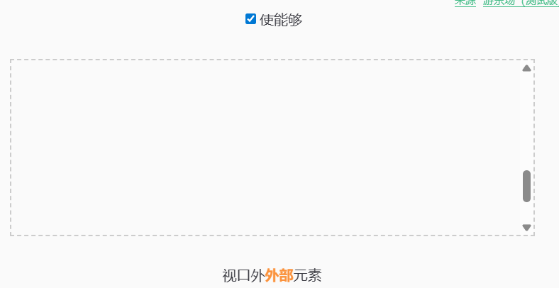

使用  在main.js

```
import { useIntersectionObserver } from '@vueuse/core'
.....
useIntersectionObserver(
          el,
          ([{ isIntersecting }]) => {
            console.log(isIntersecting)
          },
        )
```

测试  成功打印

#### 3.条件判断

```
if(isIntersecting){
                //进入了视口区域
                el.src = binging.value
            }
```

测试   成功实现进入视图区域后再发送网络请求，实现懒加载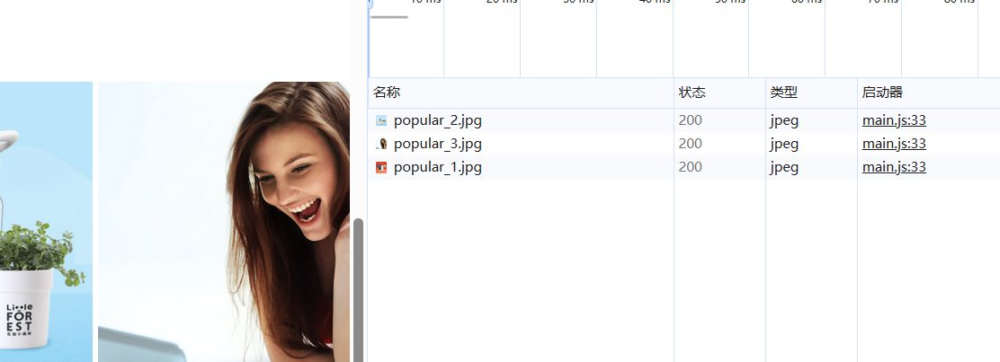


### 7.7 懒加载封装组件

创建文件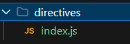

封装指令

```
import { useIntersectionObserver } from '@vueuse/core'


//定义懒加载插件
export const lazyPlugin = {
    install(app) {
        //懒加载指令逻辑
        app.directive('img-lazy',{
        mounted(el,binging){
            //el:指令绑定的那个元素
            //binging:binging.value 指令等于号后面绑定的表达式的值 图片url
            console.log(el,binging.value)
            useIntersectionObserver(
            el,
            ([{ isIntersecting }]) => {
                console.log(isIntersecting)
                if(isIntersecting){
                    //进入了视口区域
                    el.src = binging.value
                }
            },
            )
            }
        })
    }
}
```

main.js注册使用

```
//引入懒加载插件
import { lazyPlugin } from './directives'
app.use(lazyPlugin)
```


还有个问题，useIntersectionObserver监听函数在加载完图片后不停止反复监听

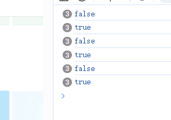

### 7.8 监听优化

加入shop停止监听

```
const { stop } = useIntersectionObserver(
                    el,
                    ([{ isIntersecting }]) => {
                        console.log(isIntersecting)
                        if (isIntersecting) {
                            //进入了视口区域
                            el.src = binging.value
                            //停止监听
                            stop()
                        }
                    },
                )
```

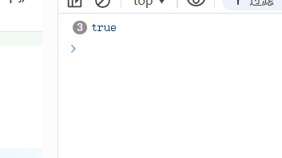


### 7.9 Product 产品列表实现

准备模板 -》 封装接口 -》 获取数据 加渲染 -》 图片懒加载

1.模板

```
<script setup>
import HomePanel from './HomePanel.vue'

</script>

<template>
  <div class="home-product">
    <!-- <HomePanel :title="cate.name" v-for="cate in goodsProduct" :key="cate.id">
      <div class="box">
        <RouterLink class="cover" to="/">
          
          <strong class="label">
            <span>{{ cate.name }}馆</span>
            <span>{{ cate.saleInfo }}</span>
          </strong>
        </RouterLink>
        <ul class="goods-list">
          <li v-for="good in cate.goods" :key="good.id">
            <RouterLink to="/" class="goods-item">
              
              <p class="name ellipsis">{{ good.name }}</p>
              <p class="desc ellipsis">{{ good.desc }}</p>
              <p class="price">&yen;{{ good.price }}</p>
            </RouterLink>
          </li>
        </ul>
      </div>
    </HomePanel> -->
  </div>
</template>

<style scoped lang='scss'>
.home-product {
  background: #fff;
  margin-top: 20px;
  .sub {
    margin-bottom: 2px;

    a {
      padding: 2px 12px;
      font-size: 16px;
      border-radius: 4px;

      &:hover {
        background: $xtxColor;
        color: #fff;
      }

      &:last-child {
        margin-right: 80px;
      }
    }
  }

  .box {
    display: flex;

    .cover {
      width: 240px;
      height: 610px;
      margin-right: 10px;
      position: relative;

      img {
        width: 100%;
        height: 100%;
      }

      .label {
        width: 188px;
        height: 66px;
        display: flex;
        font-size: 18px;
        color: #fff;
        line-height: 66px;
        font-weight: normal;
        position: absolute;
        left: 0;
        top: 50%;
        transform: translate3d(0, -50%, 0);

        span {
          text-align: center;

          &:first-child {
            width: 76px;
            background: rgba(0, 0, 0, 0.9);
          }

          &:last-child {
            flex: 1;
            background: rgba(0, 0, 0, 0.7);
          }
        }
      }
    }

    .goods-list {
      width: 990px;
      display: flex;
      flex-wrap: wrap;

      li {
        width: 240px;
        height: 300px;
        margin-right: 10px;
        margin-bottom: 10px;

        &:nth-last-child(-n + 4) {
          margin-bottom: 0;
        }

        &:nth-child(4n) {
          margin-right: 0;
        }
      }
    }

    .goods-item {
      display: block;
      width: 220px;
      padding: 20px 30px;
      text-align: center;
      transition: all .5s;

      &:hover {
        transform: translate3d(0, -3px, 0);
        box-shadow: 0 3px 8px rgb(0 0 0 / 20%);
      }

      img {
        width: 160px;
        height: 160px;
      }

      p {
        padding-top: 10px;
      }

      .name {
        font-size: 16px;
      }

      .desc {
        color: #999;
        height: 29px;
      }

      .price {
        color: $priceColor;
        font-size: 20px;
      }
    }
  }
}
</style>
```

2.接口

```
export const getGoodsAPI = () => {
  return httpInstance({
    url: '/home/goods'
  })
}
```

3.数据

```
<script setup>
import HomePanel from './HomePanel.vue'
import { getGoodsAPI } from '@/apis/home'
import { ref } from 'vue'
const goodsProduct = ref([])
const getGoods = async () => {
  const { result } = await getGoodsAPI()
  goodsProduct.value = result
}
onMounted( ()=> getGoods() )
</script>
```

4.懒加载

```
....

....

```

### 7.10 产品列表里组件封装

抽象porps参数，传入什么就显示什么

这部分组件都一样，可以封装成一个组件，插槽调用

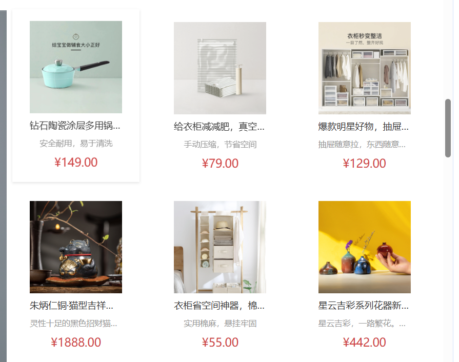

1.创建封装文件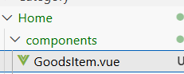

2.导入复用部分

```
<script setup>
    defineProps({
      goods:{
        type:Object,
        default:() => {} 
      }
    })
</script>

<template>
  <RouterLink to="/" class="goods-item">
    
    <p class="name ellipsis">{{ goods.name }}</p>
    <p class="desc ellipsis">{{ goods.desc }}</p>
    <p class="price">&yen;{{ goods.price }}</p>
  </RouterLink>
</template>
```

3.引用

```
import GoodsItem from './GoodsItem.vue'
....
<ul class="goods-list">
   <li v-for="goods in cate.goods" :key="goods.id">
     <GoodsItem :goods="goods" />
   </li>
</ul>
```

## 8 一级分类页

### 8.1 结构搭建和路由配置

1.创建页面

2.动态路由配置  router/index.js中

```
{
   path:'category/:id',
   component:Category
}
```

两个导航栏配置

LayoutHeader.vue  /  LayoutFixed.vue

```
<li class="home" v-for="item in categoryStore.categoryList" :key="item.id">
   <RouterLink :to="`/category/${item.id}`">{{item.name}}		</RouterLink>
</li>
```

3.鼠标放导航栏出现地址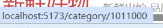

### 8.2 面包屑导航

让用户知道自己当前在哪个位置

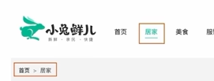

模板 -》 接口函数 -》调用接口获取数据 -》渲染模板

1.去饿了么看下面包屑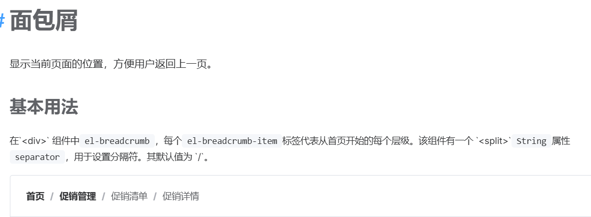

2.封装接口

id为必填传参

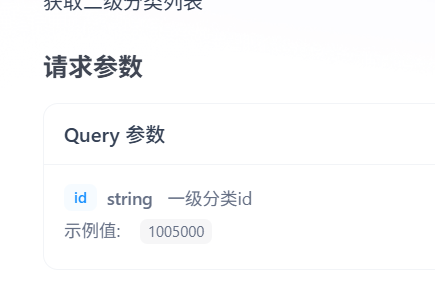

```
import request from '@/utils/http'

export function getCategoryApI(id) {
  return request({
    url: '/category',
    params:{
        id
    }
  })
}
```

3.调用接口

使用路由示例获取参数

```
<script setup>
import {getCategoryApI} from '@/apis/category.js'
import {onMounted, ref} from 'vue'
import { useRoute } from 'vue-router'

//获取数据
const categoryData  = ref([])
const route = useRoute()
const getCategory = async() =>{
  const res = await getCategoryApI(route.params.id)
  categoryData.value = res.result
}
onMounted(()=>getCategory())
</script>
```

4.测试

```
<el-breadcrumb-item>{{categoryData.name}}</el-breadcrumb-item>

```

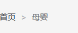

### 8.3 轮播图实现

和首页轮播图类似，可以复用

改造接口（适配参数） -》 迁移首页轮播

1.传入请求参数

params解构赋值，默认为1

```
export function getBannerAPI(params = {}) {
  //1为首页，2为分类商品页
  const {distributionSite = '1'} = params
  return httpInstance({
    url: '/home/banner',
    params:{
      distributionSite
    }
  })
}
```

改造接口

```
const res = await getBannerAPI({
   distributionSite: '2'
 })
```

2.复制模板

```
<div class="home-banner">
        <el-carousel height="500px">
          <el-carousel-item v-for="item in bannerList" :key="item.id">
            
          </el-carousel-item>
        </el-carousel>
      </div>
```

### 8.4 导航激活、分类列表渲染

在RouterLink配置类名    LayoutHeader.vue

```
<RouterLink active-class="active" :to="`/category/${item.id}`">{{item.name}}</RouterLink>

...
.active{
      color:$xtxColor;
      border-bottom: 1px solid $xtxColor;
    }
```

ok了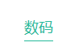

列表

```
<div class="sub-list">
        <h3>全部分类</h3>
        <ul>
          <li v-for="i in categoryData.children" :key="i.id">
            <RouterLink to="/">
              
              <p>{{ i.name }}</p>
            </RouterLink>
          </li>
        </ul>
      </div>
      <div class="ref-goods" v-for="item in categoryData.children" :key="item.id">
        <div class="head">
          <h3>- {{ item.name }}-</h3>
        </div>
        <div class="body">
          <GoodsItem v-for="good in item.goods" :goods="good" :key="good.id" />
        </div>
      </div>
```

### 8.5 路由缓存问题

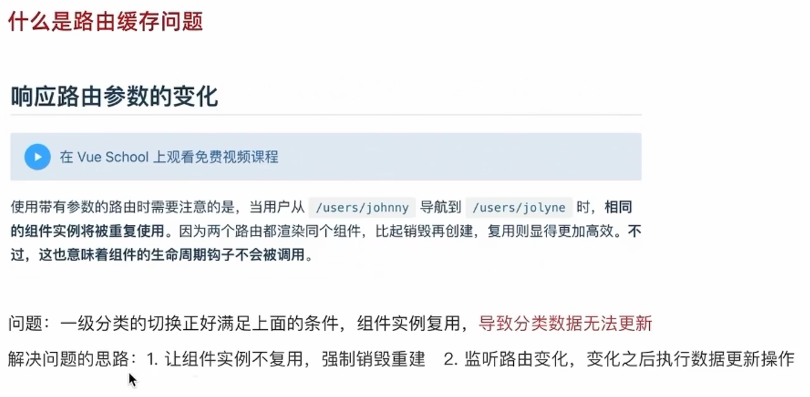

比如：切换这两个下面页面没变化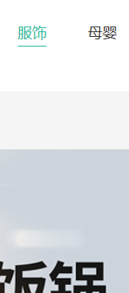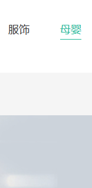

思路1：在/Layout/index.vue  路由出口 

```
 <!--添加key 破坏复用机制 强制销毁重建-->
  <RouterView :key="$route.fullPath" />
```

成功实现，但有个问题，每次切换不同分类页，Banner图是一样的，但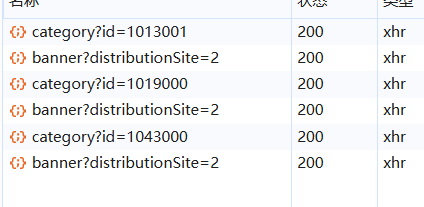

请求重复出现，资源浪费


所以思路2：在路由参数变化时，可以把分类数据数据接口重新发送

添加监听函数

```
import { onBeforeRouteUpdate, useRoute } from 'vue-router'
...
onBeforeRouteUpdate(()=>{
  console.log('路由参数变化了')
})
```

测试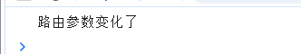

id传参

```
//获取数据
const categoryData  = ref([])
const route = useRoute()
const getCategory = async(id = route.params.id) =>{
  const res = await getCategoryApI(id)
  categoryData.value = res.result
}
onMounted(()=>getCategory())

//在路由参数变化时，可以把分类数据数据接口重新发送
onBeforeRouteUpdate((to)=>{
  console.log('路由参数变化了')
  console.log(to)
  getCategory(to.params.id)
})
```

成功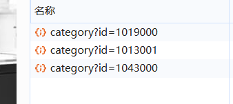